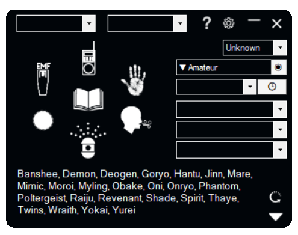
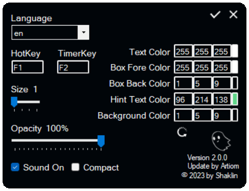
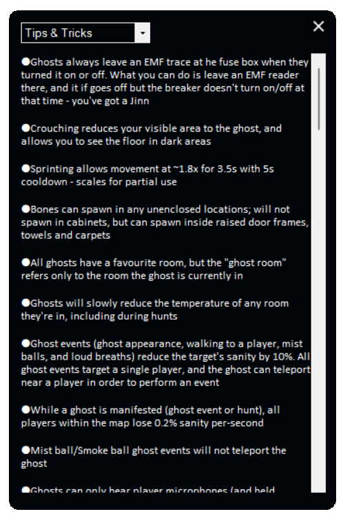

#  Phasmo Gadget 

English

## About Phasmo Gadget
The Phasmo Gadget app for *Phasmophobia* is a companion tool designed to assist players in tracking evidence, identifying ghosts, and navigating the game's mechanics more effectively. The app streamlines gameplay by helping players keep track of clues, suggesting possible ghost types based on collected evidence, and providing reminders and hints that can be especially useful for new players or those looking to improve their investigative skills in *Phasmophobia*.

## Main features
***Main Keybinds***
- **F1**: Show/hide tool
- **F2**: Start/stop the Timer

All keybinds can be changed in Settings.

***Evidence Checklist:***
Easily track the clues you've found to help determine the ghost type.
- **Left-click**: Mark evidence as found
- **Right-click**: Mark evidence as not possible

**What Each Color Means**:
- *Green*: Marked as found evidence
- *Red*: Marked as not possible evidence based on other findings
- *Red with star*: User-marked as not possible evidence

***Difficulty / Maps:***
Select any existing map and set the difficulty level.
- **Left-click/Right-click** the button to the right of the Maps ListBox to set the difficulty for the map and Timer.

***Timer:***
Choose from a few default timers in the list box to the left of the timer. All timers change based on the selected difficulty and map.
- **Left-click**: Start the Timer
- **Right-click**: Set a custom Timer

***Reset:***
- **Left-click**: Resets all information, except for the map, difficulty, and timer.

***Other Information:***
The PG tool has many list boxes, all designed to help you organize information from the truck and journal in a structured, easily accessible way.
- **Top two boxes**: Ghost's first name and surname
- **First top box on the right**: Ghost response type
- **Second top box**: Map
- **Third top box**: Timer type
- **Group of three boxes**: Objectives

***Ghost Description:***
By pressing the arrow in the bottom-right corner, you can open a ghost description where detailed information about each ghost type is stored. Select a ghost in the list box to view its description. If an evidence item appears in green, it is a guaranteed piece of evidence for that ghost.

***Compact Mode:***
Enable Compact Mode in Settings to hide unnecessary information, like name and objectives, for a streamlined view.

***Settings:***
To open Settings, left-click on the cog icon in the top-right corner.
In Settings, you can change the app language, keybinds, size, opacity, sound settings, Compact Mode, and the app color scheme.
- **Left-click** the small color buttons on the right in Settings to set colors or enter RGB values manually.

***Help:***
If you need assistance or have forgotten some important information about Phasmophobia mechanics, open the Help page. It contains details on game mechanics, including specific phrases useful in Phasmophobia.
- **Left-click** the question mark icon in the top-right corner to open Help.

***Data Folder:***
If you encounter an error or want to customize something, you can edit files in the Data folder. Names and surnames are stored in /Data, while ghost and other information can be edited in /Data/[Language]

***Note:***
This tool is independent of Phasmophobia.
It works even without the game installed.
No game data will be read, modified, or saved.

## Screenshots
 

 

## Installation and launch

### Requirements
- **OS**: Windows 10 and higher
- **Dependencies**: .Net Framework 4.8

### Installing
Simply extract all files from the archive to a folder. The folder should contain one .exe file and a Data folder.

### Launching
To launch PG, ensure all requirements are met. If everything is set up correctly, simply run the .exe file.

Русский

## О Phasmo Gadget
Приложение Phasmo Gadget для игры *Phasmophobia* — это вспомогательный инструмент, созданный для того, чтобы помочь игрокам отслеживать улики, определять типы призраков и эффективнее разбираться в механиках игры. Приложение упрощает игровой процесс, позволяя игрокам фиксировать подсказки, предлагать возможные типы призраков на основе собранных улик и предоставлять напоминания и подсказки. Это особенно полезно для новичков и тех, кто хочет улучшить свои детективные навыки в *Phasmophobia*.

## Основные возможности
***Главные горячие клавиши***
- **F1**: Показать/скрыть инструмент
- **F2**: Запустить/остановить таймер

Все горячие клавиши можно изменить в настройках.

***Список улик***
Легко отслеживайте найденные улики, чтобы определить тип призрака.
- **Левая кнопка мыши**: Отметить улику как найденную
- **Правая кнопка мыши**: Отметить улику как невозможную

**Что означают цвета**:
- *Зелёный*: Улика отмечена как найденная
- *Красный*: Улика отмечена как невозможная на основе других данных
- *Красный со звездой*: Улика вручную отмечена пользователем как невозможная

***Сложность / Карты***
Выберите любую существующую карту и установите уровень сложности.
- **Левая/Правая кнопка мыши** на кнопке справа от списка карт (Maps ListBox), чтобы установить сложность и таймер для карты.

***Таймер***
Выберите один из стандартных таймеров в списке слева от таймера. Все таймеры автоматически изменяются в зависимости от выбранной сложности и карты.
- **Левая кнопка мыши**: Запустить таймер
- **Правая кнопка мыши**: Установить пользовательский таймер

***Сброс данных***
- **Левая кнопка мыши**: Сбрасывает всю информацию, кроме карты, сложности и таймера.

***Дополнительная информация***
Приложение PG содержит множество списков, которые помогают структурировать и организовать данные из грузовика и журнала:
- **Верхние два поля**: Имя и фамилия призрака
- **Первое верхнее поле справа**: Тип отклика призрака
- **Второе верхнее поле справа**: Карта
- **Третье верхнее поле справа**: Тип таймера
- **Группа из трёх полей**: Задачи

***Описание призраков***
Нажмите стрелку в правом нижнем углу, чтобы открыть раздел описания призраков. Здесь хранится подробная информация о каждом типе призраков. Выберите призрака из списка, чтобы увидеть его описание. Если улика подсвечена зелёным, это означает, что она гарантированно относится к данному призраку.

***Компактный режим***
Включите Компактный режим в настройках, чтобы скрыть ненужную информацию, например имя или задачи, для упрощённого интерфейса.

***Настройки***
Откройте настройки, нажав на иконку шестерёнки в правом верхнем углу.
В настройках можно:
- Изменить язык приложения, горячие клавиши, размер и прозрачность
- Включить или выключить звук и Компактный режим
- Настроить цветовую схему приложения
- Цветовая схема
- Нажмите на маленькие цветные кнопки справа в настройках, чтобы выбрать цвета, или введите значения RGB вручную.

***Справка***
Если вам нужна помощь или вы забыли важную информацию о механиках Phasmophobia, откройте страницу Справки. Она содержит подробности о механиках игры, включая полезные фразы, которые работают в Phasmophobia.
- **Левая кнопка мыши**: Нажмите на значок вопроса в правом верхнем углу, чтобы открыть Справку.

***Папка Data***
Если вы столкнулись с ошибкой или хотите что-то настроить, вы можете отредактировать файлы в папке Data:
- Имена и фамилии находятся в папке /Data.
- Информация о призраках и других данных хранится в /Data/[Language].

***Примечание***
Данный инструмент является независимым от Phasmophobia.
Он работает даже без установленной игры.
Никакие игровые данные не читаются, не изменяются и не сохраняются.

## Скриншоты
 

 

## Установка и запус

### Системные требования

- **ОС**: Windows 10 и выше
- **Зависимости**: .Net Framework 4.8

### Установка
Просто распакуйте все файлы из архива в папку. Папка должна содержать один .exe файл и папку Data.

### Запус
Чтобы запустить PG, убедитесь, что выполнены все системные требования. Если всё настроено правильно, просто запустите .exe файл.

